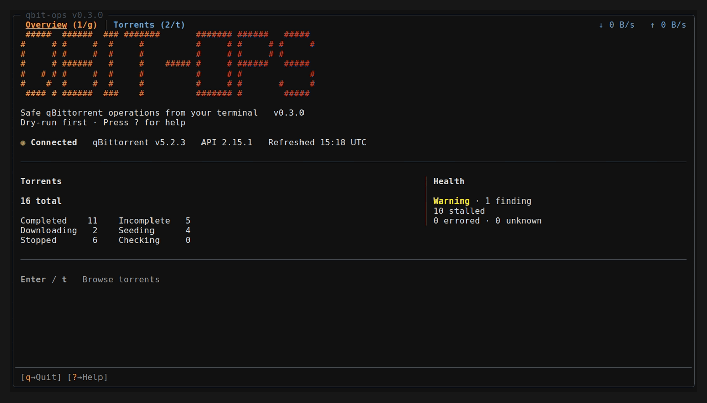
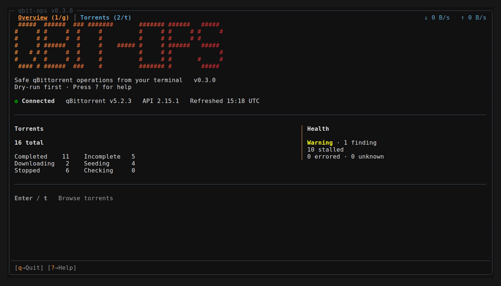
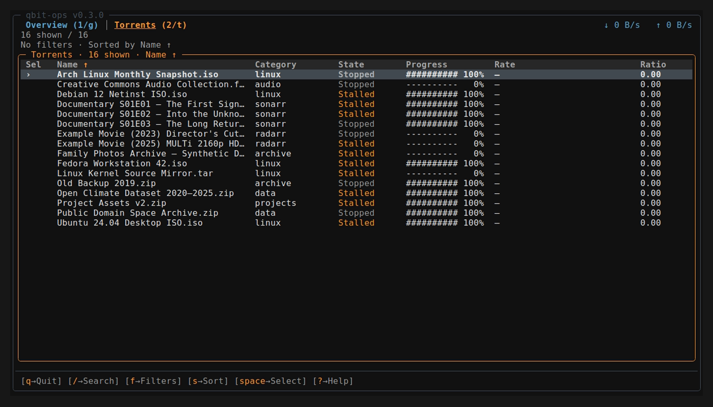
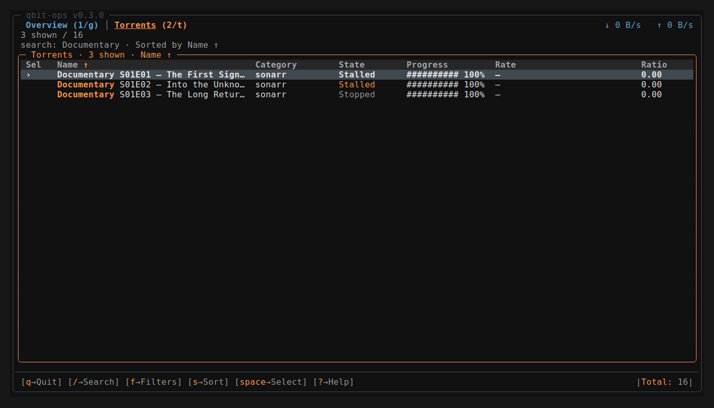
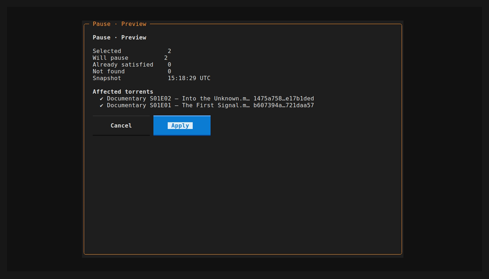

# 🧯 qbit-ops

<p align="center">
  
</p>

<p align="center">
  <a href="https://github.com/LECOQQ/qbit-ops/actions/workflows/ci.yml"></a>
  <a href="LICENSE"></a>
  <a href="pyproject.toml"></a>
  <a href="CHANGELOG.md"></a>
</p>

🧯 **A tiny qBittorrent CLI and TUI for people who don't want to nuke their
seedbox by accident.**

Inspect, diagnose and automate qBittorrent at scale - with composable filters, bulk operations, and dry-run safeguards.

> ✨ Featured in [Self-Host Weekly](https://selfh.st/weekly/2026-08-07/) by selfh.st.



## 🚀 Get started

Requires Python 3.12+ and a qBittorrent instance with the Web UI enabled.

```bash
pipx install "git+https://github.com/LECOQQ/qbit-ops.git@v0.3.0"  # x-release-please-version
```

With the optional TUI:

```bash
pipx install "git+https://github.com/LECOQQ/qbit-ops.git@v0.3.0#egg=qbit-ops[tui]"  # x-release-please-version
```

Create `~/.config/qbit-ops/.env`:

```env
QBIT_HOST=http://localhost:8080
QBIT_USER=admin
QBIT_PASSWORD=change-me
```

Then:

```bash
qbit-ops status
qbit-ops doctor
qbit-ops tui
```

## 🔍 Inspect your instance

```bash
qbit-ops torrents list --category sonarr --state stalled
qbit-ops trackers status
qbit-ops explain torrent --hash abc123
qbit-ops status --watch
```

Read commands support machine-friendly output where it makes sense:

```bash
qbit-ops torrents list --format json
qbit-ops status --format jsonl
```

## 🎯 Target exactly what you mean

Filters compose - repeat one for **or**, mix different ones for **and**,
exclude with `--exclude-*`:

```bash
qbit-ops torrents list --ratio-min 2 --seeded-for 90d --exclude-tag keep
```

Category, tag, save path, name, state, size, ratio, progress, age,
tracker and more - the same selector everywhere, listing or mutating.
Full grammar in [docs/COMMANDS.md](docs/COMMANDS.md).

## 🛠️ Make changes safely

Mutations are dry-run by default:

```bash
qbit-ops torrents pause --category sonarr
```

Review the plan, then apply it explicitly:

```bash
qbit-ops torrents pause --category sonarr --no-dry-run
```

## 🛡️ Safety by default

- 🧪 **Dry-run first.** Nothing changes unless `--no-dry-run` is explicit.
- 🎯 **Hash-based targeting.** Mutations never guess from a fuzzy torrent name.
- 🧊 **Frozen plans.** The previewed selection is the selection that gets applied.
- 🚫 **No silent “all”.** Bulk actions require a hash, `--all`, or an explicit filter.
- ❔ **Unknown is never a match.** A value qBittorrent didn't report never widens a selection.
- 🔒 **Secret-safe output.** Tracker passkeys and announce URLs stay redacted in normal output.
- ✅ **Honest results.** qbit-ops reports what was submitted or observed, not what it cannot prove.

## 🧭 How is `qbit-ops` different?

| | [qbit-ops](https://github.com/LECOQQ/qbit-ops) | [qbit_manage](https://github.com/StuffAnThings/qbit_manage) | [qbittools](https://gitlab.com/AlexKM/qbittools) |
| --- | --- | --- | --- |
| Model | Safe operational toolkit | Rules / background management | Task-oriented utilities |
| Interface | CLI + TUI | Config + scheduler + Web UI | CLI |
| Targeting | Composable selectors | Rule/workflow specific | Command specific |
| Execution | SELECT -> INSPECT -> PLAN -> APPLY | Apply configured rules | Run specialized commands |
| Best fit | Precise and quick ops, scripting | Continuous library management | Maintenance tasks |


> `qbit-ops` is deliberately not a daemon or background rules engine: select precisely, inspect the scope, preview the plan, then apply it.

See [PHILOSOPHY.md](PHILOSOPHY.md) for the reasoning behind that design.

## 🖥️ TUI

The optional Textual interface provides a branded overview, torrent browsing, filters, details, explanations, and previewed low-risk bulk actions.

```bash
qbit-ops tui
```

| Overview | Torrents |
|---|---|
|  |  |

| Search | Preview before Apply |
|---|---|
|  |  |

Press `?` inside the TUI to see the available controls.

## 🧩 Compatibility

Container integration is tested against these exact qBittorrent releases:

| qBittorrent | Web API |
|---|---:|
| 4.6.7 | 2.9.3 |
| 5.0.0 | 2.11.2 |
| 5.1.4 | 2.11.4 |
| 5.2.3 | 2.15.1 |

This is evidence for those exact versions, not a claim for the whole 4.6–5.2 range. Run `qbit-ops doctor` to compare your instance with the packaged evidence.

## 🧰 Commands

```bash
qbit-ops --help
qbit-ops torrents --help
qbit-ops trackers --help
```

A compact command overview is available in [docs/COMMANDS.md](docs/COMMANDS.md).

## 🗺️ Roadmap

See [ROADMAP.md](ROADMAP.md) for where the project is heading.

## 🧑‍💻 Development

```bash
git clone https://github.com/LECOQQ/qbit-ops.git
cd qbit-ops
make install
make check-fast
make check
```

See [CONTRIBUTING.md](CONTRIBUTING.md).

## 📄 License

MIT - see [LICENSE](LICENSE).
